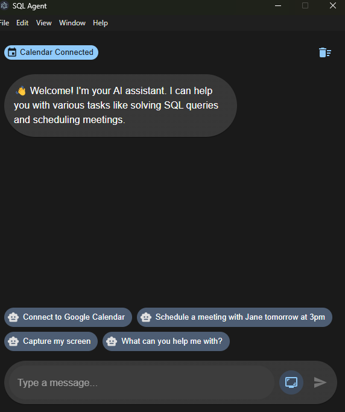
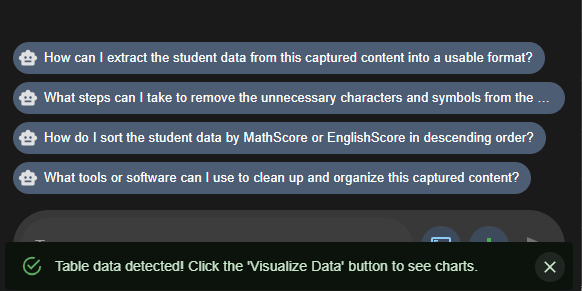
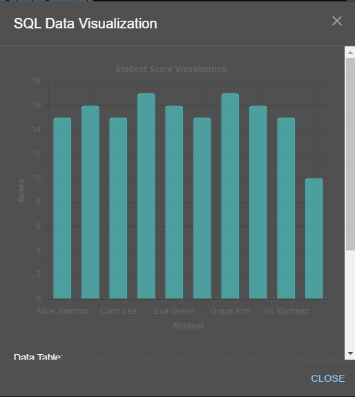
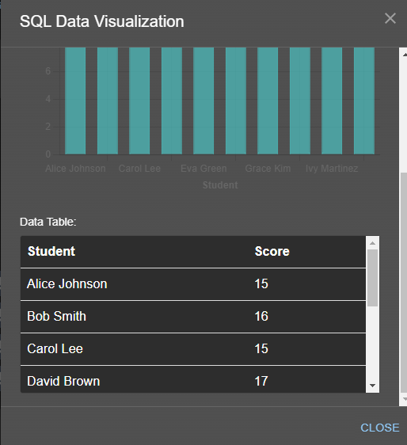
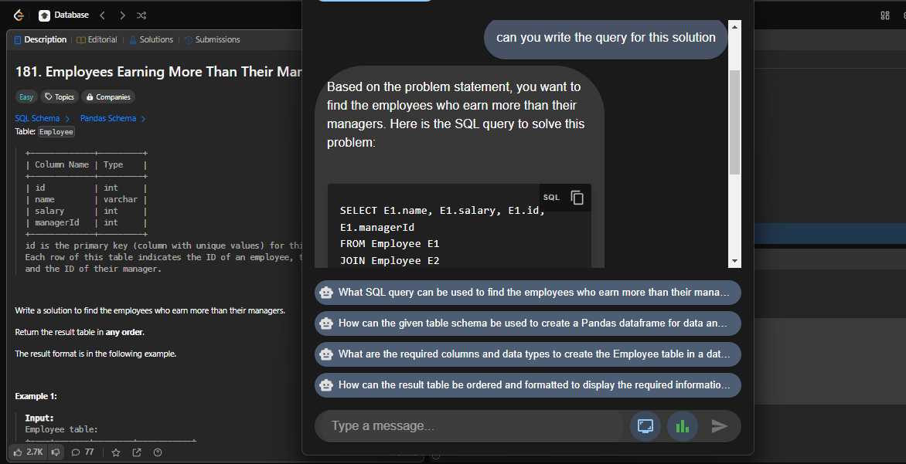
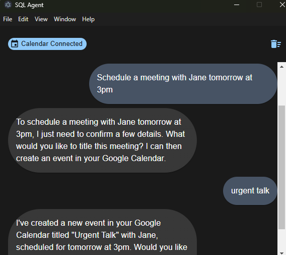

# AutoAgentX - AI-Powered Multi-Task Assistant

## Overview
This Agent is a **Desktop Application** built with **React** and **Electron**. It captures the screen, extracts text using **OCR**, and processes queries using **LLM Llama 3.3 7B Versatile Model**. The assistant can understands on-screen content to solve questions, schedule meetings by reading emails, or take other prompt-based actions and also generates SQL queries from natural language inputs and provides **accurate solutions with visual reports**.

## Features
- **Screen Capture & OCR**: Extracts SQL-related queries from the screen.
- **Natural Language to SQL**: Converts user queries into SQL commands.
- **AI-Powered Assistance**: Uses **Llama 3.3 7B** to generate responses.
- **Data Visualization**: Generates charts and reports with **Chart.js**.
- **Desktop Application**: Built with **React and Electron** for a smooth user experience.
- **Google Calendar Integration** (Additional Feature): Can schedule meetings based on user availability.

## Technologies Used
- **Frontend**: React, Electron
- **OCR**: Tesseract.js
- **AI Model**: Llama 3.3 7B Versatile Model
- **Visualization**: Chart.js
- **Google Calendar API** (for scheduling meetings)

## How It Works
1. **Capture the Screen**: The app captures the screen and extracts SQL-related text.
2. **Process the Query**: The extracted text is passed to the **LLM model**, understands visual context and allows natural language prompting to perform tasks
3. **Execute & Visualize**: The generated task is executed, and results are displayed in **text or chart format**.

## Installation
1. Clone the repository:
   ```sh
   git clone https://github.com/sneha9231/SQL_Agent
   cd sql-agent
   ```
2. Install dependencies:
   ```sh
   npm install
   ```
3. Start the application:
   ```sh
   npm start
   ```
4. Start electron application in different environment
    ```sh
    npm run electron
    ```

## Usage
- Open the application and capture your task on the screen.
- The assistant will analyze the work and generate the corresponding answers.
- Results will be displayed along with **charts or tabular data**.

## Future Enhancements
- Support for more database integrations.
- Improved OCR accuracy.
- Enhanced scheduling features.
- Send email by prompt

## Some Pictures
1. 
2. 
3. 
4. 
5. 
6. 

##

Prev Version:
[Powerpoint Presentation](https://drive.google.com/file/d/1iNMxsFH-LbT_1h4rMRBAcRBn2932BjtN/view?usp=sharing)
